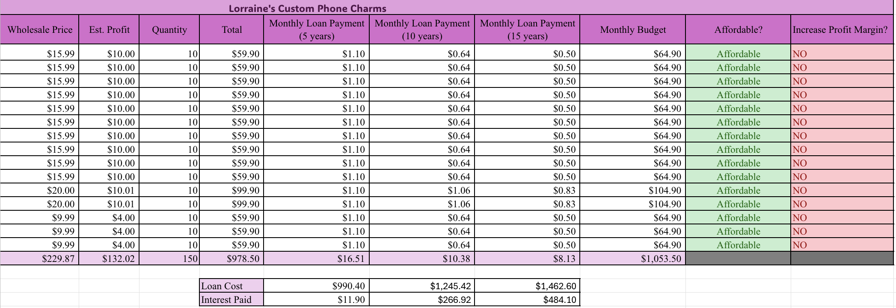
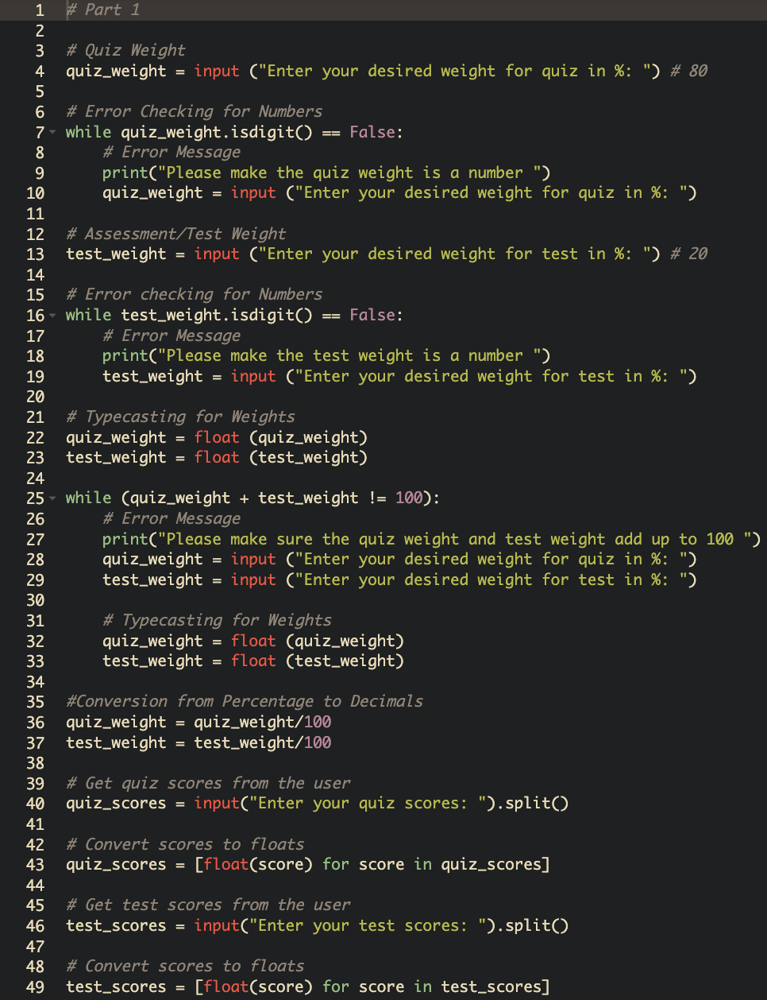
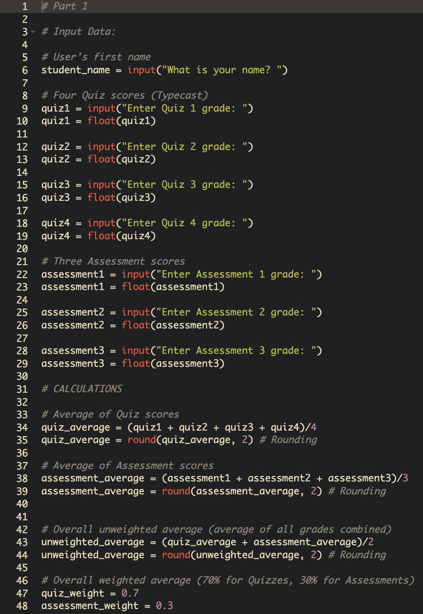
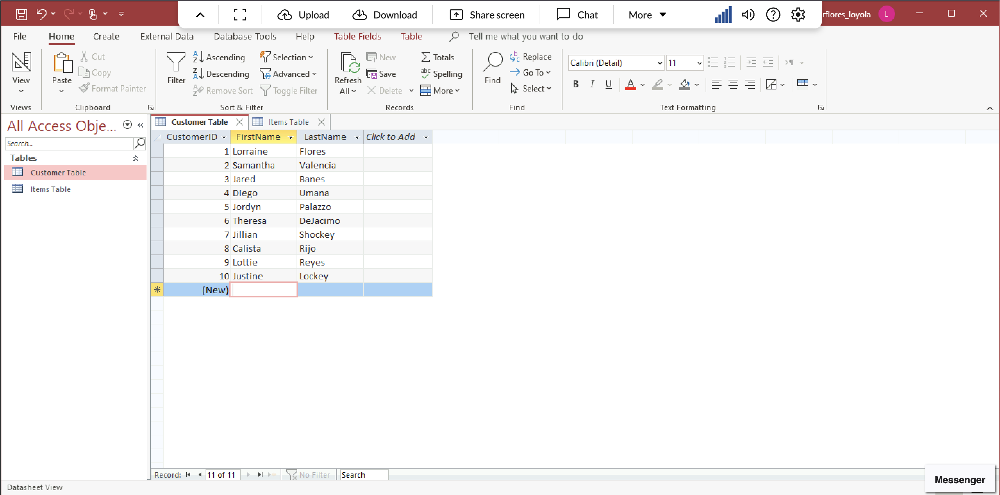
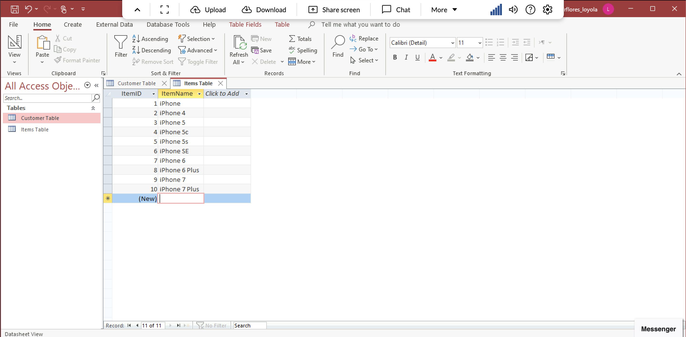

# Researcher

### About Me 
Hello! I am an experienced Researcher and Biological professional with proven expertise in Biology and Biological Commercialization.

With skills in data analysis, laboratory research, technical writing, and project management, I am able to design experiments, interpret biological data, and achieve meaningful scientific outcomes. I am adept at using Microsoft Excel, GraphPad Prism, and Python.

My detail-oriented skill set, commitment to innovation, and passion for advancing biotechnology make me a valuable asset. In my spare time, I like to read science fiction and explore nature trails.

You can find me on [LinkedIn](https://www.linkedin.com/in/yourprofile/), Twitter, or GitHub.

### Education 
BSc in Biohealth - Biological Commericalization
Loyola University, MD

### Projects

#### Data Analysis in Excel: Spreadsheets to Calculate and Visualize Trends

Initial Project Idea:
I wanted to make a well-functioning spreadsheet that could organize, calculate, and graph data trends for a small brand with limited inventory.

Tools I used:
I used Microsoft Excel to build the spreadsheet, format tables, create formulas for automatic calculations, and generate visual graphs.

Challenges I Faced:
One challenge I faced while doing this project was setting up the correct formulas and making sure everything ran smoothly. I was able to resolve the issue by testing different formulas and using Excel's built-in formula auditing tools.

Other resources:
I also watched a few videos about how to navigate through Excel and sought help from fellow classmates.

Result:
I was able to create a spreadsheet that provided a simplified data analysis of items sold by the owner as well as how much inventory was in stock.

Summary:
This project allowed me to use Excel to format and visualize, organize, and identify trends within data. I made sure to make the graphs, data, and formulas to be near and easy to read.

***
#### Python: Writing Simple Programs for Automation or Calculation

Initial Project Idea:
I wanted to write a basic Python program that could easily and automatically perform calculations and organize data, more specifically with my course grades.

Tools I used:
I used Python to write, test, and run my program.

Challenges I Faced:
One challenge I faced while doing this project was having to make sure my code was set up properly without any errors. If errors were to occur, I would go back to my code to try and resolve/debug the issue.

Other resources:
I also watched a few videos about Python, getting used to all the vocabulary needed to use it.

Result:
I was able to create a functional Python script that automated my course grades.

Summary:
This project allowed me to write my own program within Python. I was able to make a course grade calculator that was simple, yet very effective. It helped grow my knowledge with my coding and software skills.

***
#### Apporto Virtual Lab: Microsoft Access 2019

Initial Project Idea:
I wanted to make a relational database using Microsoft Access to organize, store, and query datasets.

Tools I used:
I used Microsoft Access 2019 through Apporto Virtual Lab to create tables and queries.

Challenges I Faced:
One challenge I faced while doing this project was having to make sure my tables and queries all matched up, if one letter was out of place, it would not be able to run. I made sure to carefully check every table and query so that it would run smoothly.

Other resources:
I asked fellow classmates for help when I was either confused on a certain step.

Result:
I was able to create a database with working queries that made data organization a lot easier.

Summary:
This project allowed me to show my skills in using Microsoft Access database, with setting up different tables and queries. It helped grow my organizational and dataset skills.
